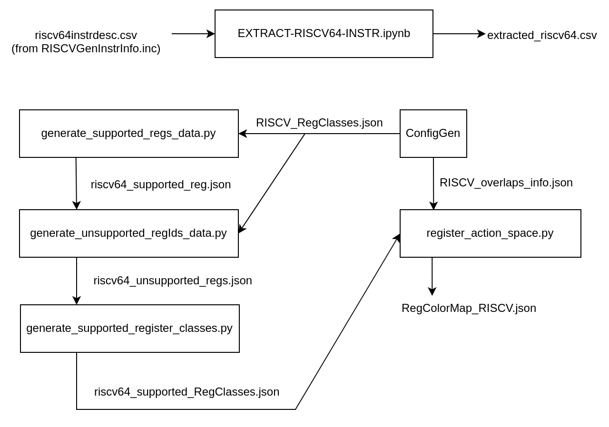

    
## Extending Support To More Architectures

The following is the process to obtain register/instruction related information for an architecture.

The flow of scripts for RISCV is drawn below.  


Register information is dumped from ConfigGen pass, with the following command:  
```bash
echo "int main(){return 0;}" | ./build/bin/clang -O3 -S -mllvm -enable-config-gen --target=<TARGET> -
```

The pass contains the two functions:
- `dumpRegisterOverlapInfo()`  $\rightarrow$ dumps TARGET_overlaps_info.json
- `dumpMCRegisterClassesJson()`$\rightarrow$ dumps TARGET_RegClasses.json


For new architectures, possible cases of Triple::ArchType should be added to these files:

- `llvm/lib/CodeGen/ConfigGen/ConfigGen.cpp`, inside `runOnMachineFunction()`
  ```bash
  case Triple::ArchType::riscv64:
  case Triple::ArchType::riscv32: {
    this->targetName = "RISCV";
    break;
  }
  ```
- `llvm/lib/CodeGen/MIR2Vec/Embeddings/utils.cpp`, inside `createOpcodeMap()`
  ```bash
  case Triple::ArchType::riscv64: {
    extFile += "/regalloc/extracted_riscv64.csv";
    break;
  }

These post-processing scripts are present in `llvm/lib/CodeGen/MLRegAlloc/register_scripts/`  

- `generate_supported_regs_data.py`  
  Generates a json file of supported registers (eg: `riscv64_supported_reg.json`)
  ```bash
  python3 generate_supported_regs_data.py <target>
  ```
  Set fileName variable to target-register-class-file, ie. TARGET_RegClasses.json  
  To support new architectures, write an elif block for the new target.


- `generate_unsupported_regIds_data.py`  
  Generates unsupported register list as complement of supported registers.
  ```bash
  python generate_unsupported_regIds_data.py <target-register-class-file-path> <supported-registers-file-path> <output-file-path>
  ```
  Example:
  ```bash
  python3 generate_unsupported_regIds_data.py AArch64_RegClasses.json AArch64_supported_reg.json AArch64_unsupported_regs.json
  ```

- `generate_supported_register_classes.py`   
  ```bash 
  python generate_supported_register_classes.py <target-register-class-file-path> <unsupported-registers-file-path> <output-file-path> 
  ```
  Example:
  ```bash
  python generate_supported_register_classes.py X86_RegClasses.json X86_unsupported_regs.json X86_supported_RegClasses.json
  ```

The JSON files are present in `llvm/lib/CodeGen/MLRegAlloc/config_json/`  

The script to generate color map is: `model/RL4ReAl/src/register_action_space.py`  
Set the variable `self.dump_color_map = True` and specify paths to 
- fileName: TARGET_supported_RegClasses.json
- overlapfile: TARGET_overlaps_info.json

Scripts related to instruction list are at `llvm/lib/CodeGen/MIR2Vec/`:   
- `EXTRACT-RISCV64-INSTR.ipynb`  
  This reformats an input file `riscvinstrdesc.csv`.  
  For a new architecture, this file can be created by copying the enum of instructions   
  from a file similar to `build/lib/Target/RISCV/RISCVGenInstrInfo.inc`

